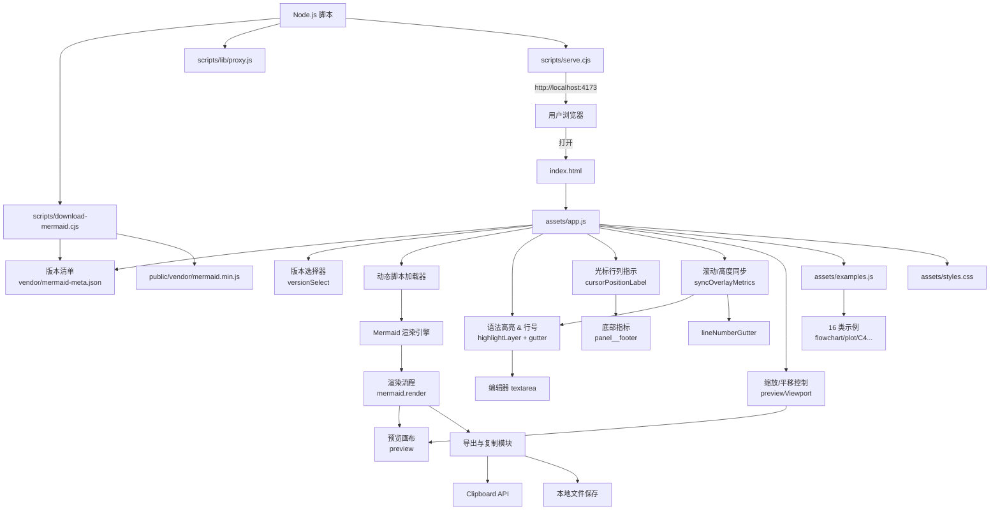
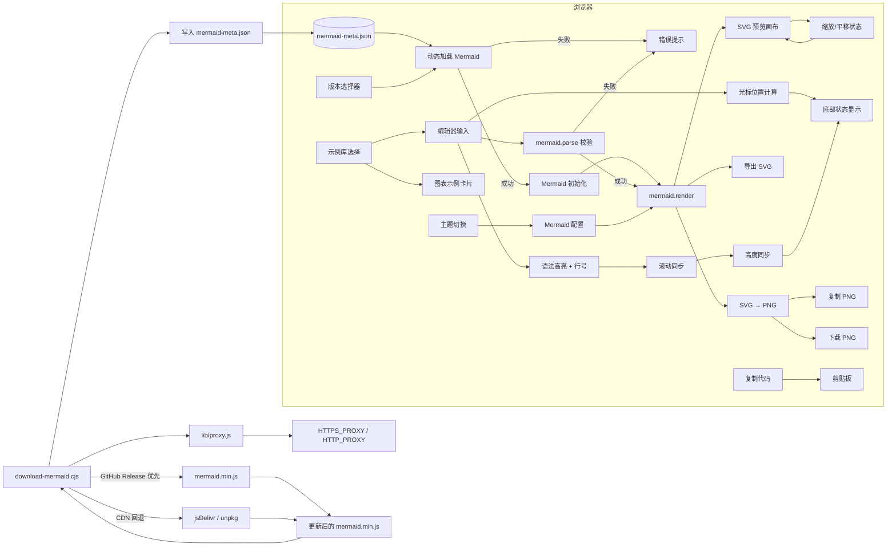
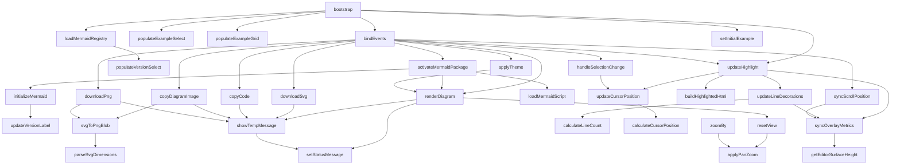

# LocalMermaid

一个可以在完全离线环境下使用的 Mermaid 渲染工作台，内置常用图表示例，支持本地编辑、实时渲染、错误提示与多版本切换。

## 功能特性

- 🚀 **开箱即用**：仓库自带 `public/vendor/mermaid.min.js`（当前为 v11.12.1）与版本清单，完全离线即可渲染。
- 🔁 **多版本切换**：读取 `mermaid-meta.json` 中的版本列表，前端可即时切换 Mermaid 内核并刷新当前图表。
- 🛠️ **编辑体验**：提供语法高亮、行号/行数统计、实时光标行列定位、快捷渲染（Ctrl/⌘ + Enter）、更宽广的编辑面板以及示例库一键载入。
- 🖱️ **预览增强**：渲染结果面板支持缩放、平移、居中复位，并可复制 PNG、导出 SVG/PNG。
- 🔍 **语法校验**：渲染前自动调用 `mermaid.parse`，第一时间暴露语法错误并提示定位。
- 🎨 **示例图库**：涵盖流程、时序、状态、旅程、甘特、类图、ER、Git Graph、饼图、折线/柱状/XY 图、思维导图、时间线、需求图、象限图、C4、桑基图等 16+ 彩色案例。

## 本次更新亮点

- 📏 扩大编辑区与预览区尺寸，长图编写时不再拥挤，同时修复语法高亮遮挡导致的「行数多时看不到尾部代码」问题。
- 🧭 新增光标行列展示与滚动同步逻辑，长文档编辑时能够迅速定位当前所在位置。
- 🗂️ 扩展示例库，覆盖用户反馈中提到的流程、旅程、C4、桑基、XY/折线/柱状等 16 类典型图表并使用醒目配色。

## 使用指南

1. **立即可用的离线包**

   > 仓库已经内置 Mermaid v11.12.1 的构建文件与静态资源，无需执行任何安装命令即可直接打开 `public/index.html` 使用。

   ```bash
   npm install
   ```

   > 可选：如需验证 Node.js 与 NPM 是否可用，可运行 `npm install`。项目不再依赖任何第三方包，该命令会瞬间完成且不会访问外网。

  - **需要升级 Mermaid 版本时**：运行 `npm run fetch:mermaid`。脚本会先尝试从 GitHub Release（`https://github.com/mermaid-js/mermaid/releases/download/vX.Y.Z/mermaid.min.js`）下载，若该版本未提供构建产物，则自动回退到 jsDelivr / unpkg CDN，并在 `public/vendor/mermaid-meta.json` 的 `packages` 列表中更新默认条目。
  - **新增或替换本地版本**：可手动下载 `mermaid.min.js` 到 `public/vendor/` 任意子目录，并在 `mermaid-meta.json` 中追加一个条目：

    ```json
    {
      "id": "mermaid-11-1-0",
      "label": "Mermaid v11.1.0（手动导入）",
      "version": "11.1.0",
      "scriptPath": "vendor/mermaid-11.1.0/mermaid.min.js",
      "source": "GitHub Releases",
      "downloadUrl": "https://github.com/mermaid-js/mermaid/releases/download/v11.1.0/mermaid.min.js",
      "downloadedAt": "2025-02-18T09:00:00.000Z"
    }
    ```

    保存后刷新页面即可在「Mermaid 版本」下拉框中看到新选项。

     ```bash
     # GitHub Release（若该版本提供）
     curl -L "https://github.com/mermaid-js/mermaid/releases/download/v11.12.1/mermaid.min.js" -o public/vendor/mermaid.min.js

     # CDN 备选
     curl -L "https://cdn.jsdelivr.net/npm/mermaid@11.12.1/dist/mermaid.min.js" -o public/vendor/mermaid.min.js
     ```

   > 下载脚本会自动读取 `HTTPS_PROXY` / `HTTP_PROXY` 环境变量（目前支持 `http://` 代理）。如需在需要代理的网络中执行，可在运行命令前设置环境变量（例如 `export HTTPS_PROXY="http://127.0.0.1:7890"`）。

2. **启动本地预览服务器（可选）**

   ```bash
   npm run start
   ```

   访问终端输出的地址（默认 `http://localhost:4173` 即可加载主页），或直接使用文件协议打开 `public/index.html`。

3. **开始绘制**

   - 在左侧编辑器输入 Mermaid 代码，点击“渲染”或使用 `Ctrl/⌘ + Enter` 快捷键。
   - 如有语法问题，错误信息会显示在预览区域顶部。
   - 支持语法高亮、行号/行数统计、光标行列提示、一键复制代码、复制 PNG、导出 SVG/PNG、版本切换，以及浅色/深色主题切换。
   - 预览面板内置缩放、平移与重置视图控制，帮助在大图场景下查看细节。

## 内置示例一览

| 图表类型 | 示例名称 |
| --- | --- |
| 🧭 流程类 | 全链路增长实验 |
| 🔁 时序图 | 实时平台回流 |
| 🧱 状态图 | 变更审批流 |
| 🔄 用户旅程 | 体验旅程 |
| 🧬 甘特图 | 迭代规划 |
| 🧩 类图 | 领域建模 |
| 🕸️ ER 图 | 电商模型 |
| 🔗 Git Graph | 版本发布 |
| 🌍 饼图 | 渠道构成 |
| 📈 折线图 | 活跃趋势 |
| 📊 柱状图 | 渠道转化率 |
| 📈 XY 图 | 转化 vs 留存 |
| 🧠 思维导图 | 项目规划 |
| 🗂️ 时间线 | 发布计划 |
| 🔄 Requirement | 需求追踪 |
| 🧭 象限图 | 优先级矩阵 |
| ⚙️ C4 | 系统容器视图 |
| 📊 Sankey | 漏斗流向 |

## 项目结构

```
LocalMermaid/
├── package.json                # NPM 脚本与项目元数据
├── public/
│   ├── assets/
│   │   ├── app.js             # 前端逻辑与渲染控制
│   │   └── styles.css         # 页面样式
│   ├── index.html             # 页面入口
│   └── vendor/                # 存放离线的 mermaid 发行文件
│       ├── mermaid.min.js     # 仓库默认内置的 Mermaid v11.12.1
│       └── mermaid-meta.json  # Mermaid 版本清单（支持多版本切换）
├── scripts/
│   ├── download-mermaid.cjs   # 下载最新 mermaid 的辅助脚本
│   ├── lib/
│   │   └── proxy.js           # 轻量代理解析与 CONNECT 实现
│   └── serve.cjs              # 简易静态服务器（可选）
└── README.md
```

## 系统架构图



## 数据流图



## 调用图



## 用户视角用例

```mermaid
usecaseDiagram
  actor User
  rectangle LocalMermaid {
    usecase UC1 as "选择预置示例"
    usecase UC2 as "编辑并渲染 Mermaid 图"
    usecase UC3 as "查看渲染错误提示"
    usecase UC4 as "复制当前代码"
    usecase UC5 as "导出 SVG 文件"
    usecase UC6 as "切换浅色/深色主题"
    usecase UC7 as "复制渲染 PNG"
    usecase UC8 as "下载 PNG 图像"
    usecase UC9 as "切换 Mermaid 版本"
    usecase UC10 as "缩放/平移预览图"
    usecase UC11 as "查看行号与行数"
    usecase UC12 as "查看光标所在行列"
    usecase UC13 as "浏览多类型示例"
  }
  User --> UC1
  User --> UC2
  User --> UC3
  User --> UC4
  User --> UC5
  User --> UC6
  User --> UC7
  User --> UC8
  User --> UC9
  User --> UC10
  User --> UC11
  User --> UC12
  User --> UC13
```

## 许可证

MIT
