# LocalMermaid

一个可以在完全离线环境下使用的 Mermaid 渲染工作台，内置常用图表示例，支持本地编辑、实时渲染、错误提示与多版本切换。

## 功能特性

- 🚀 **开箱即用**：仓库自带 `public/vendor/mermaid.min.js`（当前为 v11.12.1）与版本清单，完全离线即可渲染。
- 🔁 **多版本切换**：读取 `mermaid-meta.json` 中的版本列表，前端可即时切换 Mermaid 内核并刷新当前图表。
- 🛠️ **编辑体验**：提供语法高亮、行号/行数统计、实时光标行列定位、快捷渲染（Ctrl/⌘ + Enter）、字体同步机制以及更宽广的编辑面板与示例弹窗一键载入。
- 🖱️ **预览增强**：渲染结果面板支持缩放、平移、居中复位，默认将图表顶部居中展示，并可复制 PNG、导出 SVG/PNG。
- 🤖 **AI 助手**：编辑器前置一个轻量 AI 快速输入框，点击后展开输入；支持测试 AI 接口、手动修复渲染与自动修复，修复时自动附带 Mermaid 版本信息，配置与模板在弹窗内维护，调用后自动回写 Mermaid。
- 🧯 **错误提示**：AI 接口报错会在快速输入区显示错误卡片，方便排查网络或配置问题。
- ⏳ **执行状态**：AI 请求中会显示状态卡片，用户可手动关闭，成功或失败后自动隐藏。
- 🎻 **视觉风格**：采用古典衬线字体、徽章饰线与柔和纹理渐变，增强留白与层次，整体更优雅。
- 🧭 **顶部导航**：更紧凑的顶部栏样式，减少空间占用并保持关键入口可见。
- 🧩 **CORS 处理**：内置本地代理模式，解决浏览器调用外部模型 API 的跨域问题。
- ⚠️ **配置提醒**：未配置 AI 地址/模型/Key 时调用 AI 会在页面提示补全信息。
- ⏫ **快速定位**：浮动按钮支持一键跳转页面顶部/底部，长页面也能迅速回到编辑器或示例弹窗。
- 🔍 **语法校验**：渲染前自动调用 `mermaid.parse`，第一时间暴露语法错误并提示定位。
- 🎨 **示例图库**：涵盖流程、时序、状态、旅程、甘特、类图、ER、Git Graph、饼图、折线/柱状/XY 图、思维导图、时间线、需求图、象限图、C4、桑基图等 16+ 彩色案例，全部通过 v11.12.1 语法校验。

## 本次更新亮点

- 🤖 AI 修复按钮移动到渲染结果区域，手动修复时自动携带 Mermaid 版本信息。
- 🧯 AI 接口失败时展示错误提示卡片，避免失败信息被忽略。
- ⏳ AI 请求状态完整呈现“请求中 → 成功/失败”，并展示可手动关闭的状态卡片。
- 🧭 顶部区域改为导航条样式，并整体采用古典风格排版与装饰线条。
- 🧩 保留 AI 自动修复与本地代理模式，减少渲染失败与 CORS 阻断带来的影响。
- 📚 更新 README 的系统架构图、数据流图、调用图与用户用例图，补充 AI 弹窗打开与关闭路径。
- 🔢 修复超长 Mermaid 文档的行号显示问题，确保 300 行以上也能完整呈现。
- 🛠️ 强化 AI 修复提示，确保根据当前 Mermaid 版本修复缺失 end 等语法错误，并在必要时转换为兼容图类型。
- 🧹 Mermaid 报错时关闭引擎默认错误渲染，避免页面底部出现额外报错文本。
- 📏 修复行数统计在结尾换行时偏多的问题，确保显示与实际行数一致。
- 📋 复制 PNG 时增加数据链接兜底策略，避免部分浏览器误报“不支持复制”。

## 使用指南

1. **立即可用的离线包**

   > 仓库已经内置 Mermaid v11.12.1 的构建文件与静态资源，无需执行任何安装命令即可直接打开 `public/index.html` 使用。

   ```bash
   npm install
   ```

   > 可选：如需验证 Node.js 与 NPM 是否可用，可运行 `npm install`。项目不再依赖任何第三方包，该命令会瞬间完成且不会访问外网。

  - **需要升级 Mermaid 版本时**：运行 `npm run fetch:mermaid`。脚本会先尝试从 GitHub Release（`https://github.com/mermaid-js/mermaid/releases/download/vX.Y.Z/mermaid.min.js`）下载，若该版本未提供构建产物，则自动回退到 jsDelivr / unpkg CDN，并在 `public/vendor/mermaid-meta.json` 的 `packages` 列表中更新默认条目。
  - **新增或替换本地版本**：可手动下载 `mermaid.min.js` 到 `public/vendor/` 任意子目录，并在 `mermaid-meta.json` 中追加一个条目：

    ```json
    {
      "id": "mermaid-11-1-0",
      "label": "Mermaid v11.1.0（手动导入）",
      "version": "11.1.0",
      "scriptPath": "vendor/mermaid-11.1.0/mermaid.min.js",
      "source": "GitHub Releases",
      "downloadUrl": "https://github.com/mermaid-js/mermaid/releases/download/v11.1.0/mermaid.min.js",
      "downloadedAt": "2025-02-18T09:00:00.000Z"
    }
    ```

    保存后刷新页面即可在「Mermaid 版本」下拉框中看到新选项。

     ```bash
     # GitHub Release（若该版本提供）
     curl -L "https://github.com/mermaid-js/mermaid/releases/download/v11.12.1/mermaid.min.js" -o public/vendor/mermaid.min.js

     # CDN 备选
     curl -L "https://cdn.jsdelivr.net/npm/mermaid@11.12.1/dist/mermaid.min.js" -o public/vendor/mermaid.min.js
     ```

   > 下载脚本会自动读取 `HTTPS_PROXY` / `HTTP_PROXY` 环境变量（目前支持 `http://` 代理）。如需在需要代理的网络中执行，可在运行命令前设置环境变量（例如 `export HTTPS_PROXY="http://127.0.0.1:7890"`）。

2. **启动本地预览服务器（可选）**

   ```bash
   npm run start
   ```

   访问终端输出的地址（默认 `http://localhost:4173` 即可加载主页），或直接使用文件协议打开 `public/index.html`。

3. **开始绘制**

   - 在左侧编辑器输入 Mermaid 代码，点击“渲染”或使用 `Ctrl/⌘ + Enter` 快捷键。
   - 如有语法问题，错误信息会显示在预览区域顶部。
   - 支持语法高亮、行号/行数统计、光标行列提示、一键复制代码、复制 PNG、导出 SVG/PNG、版本切换，以及浅色/深色主题切换。
   - 预览面板内置缩放、平移与重置视图控制，帮助在大图场景下查看细节。
   - AI 快速输入框常驻页面，输入需求即可调用已配置的模型并回写 Mermaid；如需修改 API 或模板，可点击“AI 助手”。
   - 点击“查看示例/打开示例库”会弹出示例弹窗，可快速选中并载入示例。
   - AI 助手可配置模型 API 地址与 Key，并保存提示词模板，一键完成 Mermaid 代码优化或架构图生成；支持渲染报错自动修复与用户补充输入。
   - 若遇到 CORS 报错，可勾选“通过本地代理请求”，并通过 `npm run start` 启动本地服务器使用代理转发。

## 内置示例一览

| 图表类型 | 示例名称 |
| --- | --- |
| 🧭 流程类 | 全链路增长实验 |
| 🔁 时序图 | 实时平台回流 |
| 🧱 状态图 | 变更审批流 |
| 🔄 用户旅程 | 体验旅程 |
| 🧬 甘特图 | 迭代规划 |
| 🧩 类图 | 领域建模 |
| 🕸️ ER 图 | 电商模型 |
| 🔗 Git Graph | 版本发布 |
| 🌍 饼图 | 渠道构成 |
| 📈 折线图 | 活跃趋势 |
| 📊 柱状图 | 渠道转化率 |
| 📈 XY 图 | 转化 vs 留存 |
| 🧠 思维导图 | 项目规划 |
| 🗂️ 时间线 | 发布计划 |
| 🔄 Requirement | 需求追踪 |
| 🧭 象限图 | 优先级矩阵 |
| ⚙️ C4 | 系统容器视图 |
| 📊 Sankey | 漏斗流向 |

## 项目结构

```
LocalMermaid/
├── package.json                # NPM 脚本与项目元数据
├── public/
│   ├── assets/
│   │   ├── app.js             # 前端逻辑与渲染控制
│   │   └── styles.css         # 页面样式
│   ├── index.html             # 页面入口
│   └── vendor/                # 存放离线的 mermaid 发行文件
│       ├── mermaid.min.js     # 仓库默认内置的 Mermaid v11.12.1
│       └── mermaid-meta.json  # Mermaid 版本清单（支持多版本切换）
├── scripts/
│   ├── download-mermaid.cjs   # 下载最新 mermaid 的辅助脚本
│   ├── lib/
│   │   └── proxy.js           # 轻量代理解析与 CONNECT 实现
│   └── serve.cjs              # 简易静态服务器（可选）
└── README.md
```

## 系统架构图

```mermaid
graph TD
  User[用户浏览器] -->|打开| Index[index.html]
  Index --> App[assets/app.js]
  Index --> HeaderBar[顶部导航栏]
  App --> ClassicTheme[古典风格样式]
  App --> VersionManifest[版本清单<br/>vendor/mermaid-meta.json]
  App --> VersionSelect[版本选择器<br/>versionSelect]
  App --> Loader[动态脚本加载器]
  Loader --> Mermaid[Mermaid 渲染引擎]
  App --> HighlightLayer[语法高亮 & 行号<br/>highlightLayer + gutter]
  App --> CursorIndicator[光标行列指示<br/>cursorPositionLabel]
  App --> OverlaySync[滚动/高度同步<br/>syncOverlayMetrics]
  App --> TypographySync[字体同步器<br/>--editor-font-size + syncEditorTypography]
  OverlaySync --> HighlightLayer
  OverlaySync --> Gutter[lineNumberGutter]
  TypographySync --> HighlightLayer
  TypographySync --> Gutter
  TypographySync --> Editor[编辑器 textarea]
  CursorIndicator --> FooterMetrics[底部指标<br/>panel__footer]
  App --> PanZoom[预览布局 & 平移缩放<br/>previewViewport]
  App --> LayoutTuner[工作区调优<br/>updateScrollControlsVisibility]
  App --> Examples[assets/examples.js<br/>示例集]
  App --> ExamplesModal[示例弹窗]
  ExamplesModal --> Gallery[16 类示例<br/>flowchart/xychart/C4...]
  Examples --> SyntaxAudit[语法校验（11.12.1）]
  SyntaxAudit --> Gallery
  App --> Styles[assets/styles.css]
  App --> LayoutGrid[页面布局栅格<br/>grid-template-areas]
  LayoutGrid --> EditorPanel[编辑器面板]
  LayoutGrid --> PreviewPanel[预览面板]
  LayoutGrid --> AiPanel
  LayoutTuner --> Styles
  LayoutTuner --> ScrollControls[快速滚动控制<br/>scrollControls]
  ScrollControls --> SmoothScroll[平滑滚动器<br/>scrollPage]
  App --> AiQuickPanel[AI 快速输入面板<br/>聚焦展开]
  AiQuickPanel --> AiRequester
  AiQuickPanel --> AiTest[接口可用性测试]
  App --> PreviewPanelFix[预览区 AI 修复按钮]
  PreviewPanelFix --> AiRequester
  AiRequester --> AiErrorCard[AI 错误提示卡片]
  AiRequester --> AiProgressCard[AI 状态卡片<br/>请求/成功/失败]
  AiRequester --> AiFixPolicy[版本兼容修复规则]
  App --> AiLauncher[AI 打开按钮]
  AiLauncher --> AiPanel[AI 助手弹窗]
  AiPanel --> AiConfig[模型配置表单]
  AiPanel --> PromptTemplates[提示词模板管理]
  AiPanel --> AutoFixToggle[自动修复开关]
  AiPanel --> ProxyToggle[本地代理开关]
  AiConfig --> LocalStore[浏览器本地存储<br/>localStorage]
  PromptTemplates --> LocalStore
  PromptTemplates --> DefaultPrompt[默认提示词模板]
  AiPanel --> AiRequester[AI 请求器<br/>runAiTask]
  AiRequester --> AiParser[响应解析器<br/>extractMermaidCode]
  AiParser --> Editor
  AiRequester --> ProxyEndpoint[/proxy 代理]
  ProxyEndpoint --> LlmApi[模型 API]
  Mermaid --> RenderPipeline[渲染流程<br/>mermaid.render]
  Mermaid --> ErrorSuppress[关闭错误渲染]
  RenderPipeline --> SvgBuilder[SVG 构建器<br/>buildSvgElement]
  SvgBuilder --> NamespaceGuard[命名空间补全<br/>ensureSvgNamespaces]
  NamespaceGuard --> PreviewSizer[SVG 尺寸同步<br/>syncPreviewCanvasSize]
  PreviewSizer --> Preview[预览画布<br/>preview]
  PanZoom --> Preview
  SvgBuilder --> CanvasSanitizer[SVG 清理器<br/>sanitizeSvgForCanvas]
  CanvasSanitizer --> NamespaceGuard
  CanvasSanitizer --> DataUriEncoder[数据 URI 编码器<br/>buildSvgDataUrl]
  HighlightLayer --> Editor
  PreviewSizer --> Exporters[导出与复制模块]
  NamespaceGuard --> Exporters
  DataUriEncoder --> Exporters
  Exporters --> Clipboard[Clipboard API]
  Exporters --> FileSave[本地文件保存]
  Scripts[Node.js 脚本] --> Downloader[scripts/download-mermaid.cjs]
  Scripts --> ProxyHelper[scripts/lib/proxy.js]
  Scripts --> DevServer[scripts/serve.cjs]
  DevServer --> ProxyEndpoint
  Downloader --> VersionManifest
  Downloader --> MermaidBundle[public/vendor/mermaid.min.js]
  DevServer -->|http://localhost:4173| User
```

## 数据流图

```mermaid
flowchart LR
  subgraph 浏览器
    VersionManifest[(mermaid-meta.json)] --> LoaderState[动态加载 Mermaid]
    VersionSelect[版本选择器] --> LoaderState
    LoaderState -->|成功| MermaidReady[Mermaid 初始化]
    LoaderState -->|失败| ErrorBox[错误提示]
    MermaidReady --> Render[mermaid.render]
    EditorInput[编辑器输入] --> Highlight[语法高亮 + 行号]
    EditorInput --> TypographySyncDF[字体同步器]
    TypographySyncDF --> Highlight
    TypographySyncDF --> LineNumbers[lineNumberGutter]
    Highlight --> EditorScroll[滚动同步]
    EditorScroll --> OverlaySizer[高度同步]
    LineNumbers --> OverlaySizer
    EditorInput --> Validate[mermaid.parse 校验]
    Validate -->|成功| Render
    Validate -->|失败| ErrorBox
    Render --> SvgBuilderDF[SVG 构建器]
    MermaidReady --> ErrorSuppressDF[关闭错误渲染]
    SvgBuilderDF --> NamespaceGuardDF[命名空间补全]
    NamespaceGuardDF --> PreviewSizerDF[SVG 尺寸同步]
    PreviewSizerDF --> Preview[SVG 预览画布]
    Preview --> PanZoom[缩放/平移状态]
    PanZoom --> Preview
    NamespaceGuardDF --> SvgExport[导出 SVG]
    SvgBuilderDF --> CanvasSanitizerDF[SVG 清理器]
    CanvasSanitizerDF --> NamespaceGuardDF
    CanvasSanitizerDF --> DataUriEncoderDF[数据 URI 编码]
    DataUriEncoderDF --> PngPipeline[SVG → PNG]
    PreviewSizerDF --> PngPipeline
    ExamplesModal[示例弹窗] --> ExampleValidator["示例语法校验 (11.12.1)"]
    ExampleValidator --> EditorInput
    ExamplesModal --> GalleryBoard[图表示例卡片]
    EditorInput --> CursorTracker[光标位置计算]
    CursorTracker --> FooterStats[底部状态显示]
    OverlaySizer --> FooterStats
    ThemeToggle[主题切换] --> MermaidConfig[Mermaid 配置]
    MermaidConfig --> Render
    PngPipeline --> ClipboardPNG[复制 PNG]
    PngPipeline --> PngDownload[下载 PNG]
    CopyButton[复制代码] --> ClipboardText[剪贴板]
    LayoutMonitor[滚动状态监听<br/>updateScrollControlsVisibility] --> ScrollControlsUI[顶部/底部按钮]
    ScrollControlsUI --> SmoothScrollDF[scrollPage 平滑滚动]
    SmoothScrollDF --> WindowScroll[window.scrollTo]
    WindowScroll --> LayoutMonitor
    LayoutGridDF[布局栅格] --> EditorInput
    LayoutGridDF --> Preview
    LayoutGridDF --> AiQuickPanelDF[AI 快速输入<br/>聚焦展开]
    AiQuickPanelDF --> AiRequest
    AiQuickPanelDF --> AiTestDF[接口测试]
    PreviewPanelDF[预览区] --> AiManualFixDF[手动修复]
    AiManualFixDF --> AiRequest
    HeaderBarDF[顶部导航栏] --> LayoutGridDF
    AiRequest --> AiErrorCardDF[错误提示卡片]
    AiRequest --> AiProgressCardDF[执行状态卡片<br/>请求/成功/失败]
    AiRequest --> AiFixPolicyDF[版本兼容修复规则]
    ClassicThemeDF[古典配色与排版] --> LayoutGridDF
    LayoutGridDF --> AiLauncherDF[AI 打开按钮]
    AiLauncherDF --> AiModalDF[AI 弹窗]
    AiModalDF --> AiForm
    AiForm[AI 配置表单] --> AiSettingsStore[本地存储 localStorage]
    AiTemplates[提示词模板] --> AiSettingsStore
    AiSettingsStore --> DefaultPromptDF[默认提示词模板]
    AiTemplates --> PromptBody[提示词内容]
    AutoFixToggleDF[自动修复开关] --> AiSettingsStore
    ProxyToggleDF[本地代理开关] --> AiSettingsStore
    PromptBody --> AiRequest[AI 请求 payload]
    EditorInput --> AiRequest
    RenderError[渲染错误提示] --> AutoFixTrigger[触发 AI 自动修复]
    AutoFixTrigger --> AiRequest
    AiRequest -->|fetch| ProxyEndpointDF[/proxy 代理]
    ProxyEndpointDF --> LlmApi[模型 API]
    LlmApi --> AiResponse[模型响应]
    AiResponse --> AiParser[Mermaid 代码解析]
    AiParser --> EditorInput
  end
  Downloader[download-mermaid.cjs] -->|GitHub Release 优先| Github[mermaid.min.js]
  Downloader -->|CDN 回退| CDN[jsDelivr / unpkg]
  Downloader --> ProxyHelper[lib/proxy.js]
  ProxyHelper --> ProxyEnv[HTTPS_PROXY / HTTP_PROXY]
  Github --> MermaidBundle[更新后的 mermaid.min.js]
  CDN --> MermaidBundle
  MermaidBundle --> Downloader
  Downloader --> ManifestUpdate[写入 mermaid-meta.json]
  ManifestUpdate --> VersionManifest
```

## 调用图

```mermaid
graph TD
  bootstrap --> loadRegistry[loadMermaidRegistry]
  bootstrap --> populateGrid[populateExampleGrid]
  bootstrap --> bind[bindEvents]
  bootstrap --> updateHighlight
  bootstrap --> syncTypography[syncEditorTypography]
  bootstrap --> setInitialExample
  bootstrap --> aiInit[initializeAiAssistant]
  bootstrap --> layoutStyles[布局样式（styles.css）]
  loadRegistry --> populateVersionSelect
  bind --> render[renderDiagram]
  bind --> copy[copyCode]
  bind --> download[downloadSvg]
  bind --> copyPng[copyDiagramImage]
  bind --> downloadPng[downloadPng]
  bind --> aiApplyPrompt[applySelectedPrompt]
  bind --> aiSavePrompt[savePromptTemplate]
  bind --> aiDeletePrompt[deletePromptTemplate]
  bind --> openAiModal
  bind --> closeAiModal
  bind --> aiQuickModify[AI 快速修改按钮]
  bind --> aiQuickGenerate[AI 快速生成按钮]
  bind --> aiQuickFix[预览区 AI 修复按钮]
  bind --> aiTest[AI 接口测试按钮]
  bind --> openExamplesModal
  bind --> closeExamplesModal
  bootstrap --> headerReady[顶部导航渲染]
  bootstrap --> themeReady[古典主题样式载入]
  bind --> aiAutoFixToggle[autoFix change handler]
  bind --> aiProxyToggle[proxy change handler]
  bind --> applyTheme
  bind --> activate[activateMermaidPackage]
  bind --> updateHighlight
  bind --> syncScroll[syncScrollPosition]
  bind --> cursorEvents[handleSelectionChange]
  bind --> resizeHandler[window.resize handler]
  bind --> fontWatcher[document.fonts.loadingdone]
  activate --> loadScript[loadMermaidScript]
  activate --> initialize[initializeMermaid]
  activate --> render
  initialize --> updateVersionLabel
  initialize --> suppressErrors[suppressErrorRendering]
  render --> svgBuilder[buildSvgElement]
  render --> namespaceGuard[ensureSvgNamespaces]
  namespaceGuard --> sizeSync[syncPreviewCanvasSize]
  render --> resetView
  render --> setStatus[setStatusMessage]
  render --> errorHandler[handleRenderError]
  svgBuilder --> domParser[DOMParser.parseFromString]
  svgBuilder --> xmlSerializer[XMLSerializer]
  svgBuilder --> namespaceGuard
  sizeSync --> sizeCalc[calculateSvgDimensions]
  sizeCalc --> parseDim[parseDimension]
  resetView --> applyPanZoom
  zoom[zoomBy] --> applyPanZoom
  applyTheme --> render
  applyTheme --> syncTypography
  updateHighlight --> buildHighlight[buildHighlightedHtml]
  updateHighlight --> updateLines[updateLineDecorations]
  updateHighlight --> overlaySync[syncOverlayMetrics]
  updateHighlight --> cursorUpdate[updateCursorPosition]
  updateLines --> calcLines[calculateLineCount]
  updateLines --> overlaySync
  syncScroll --> overlaySync
  cursorEvents --> cursorUpdate
  cursorUpdate --> cursorCalc[calculateCursorPosition]
  resizeHandler --> syncTypography
  fontWatcher --> syncTypography
  syncTypography --> normalizeLineHeight[normalizeLineHeight]
  normalizeLineHeight --> lineHeightRatio[getEditorLineHeightRatio]
  overlaySync --> surfaceHeight[getEditorSurfaceHeight]
  copyPng --> svgToPng[svgToPngBlob]
  downloadPng --> svgToPng
  svgToPng --> sanitizeSvg[sanitizeSvgForCanvas]
  svgToPng --> dataUriBuilder[buildSvgDataUrl]
  dataUriBuilder --> svgToPng
  sanitizeSvg --> namespaceGuard
  svgToPng --> parseSize[parseSvgDimensions]
  parseSize --> sizeCalc
  aiInit --> aiLoad[loadAiSettings]
  aiInit --> aiForm[applyAiSettingsToForm]
  aiInit --> aiPromptSelect[refreshPromptSelect]
  aiLoad --> aiDefaults[DEFAULT_AI_SETTINGS]
  aiQuickModify --> aiPayload[buildAiRequestPayload]
  aiQuickModify --> aiFetch[fetch API]
  aiFetch --> aiParse[extractMermaidCode]
  aiParse --> applyCode[applyMermaidCode]
  applyCode --> updateHighlight
  applyCode --> render
  showMessage[showTempMessage] --> setStatus
  render --> showMessage
  download --> showMessage
  copy --> showMessage
  copyPng --> showMessage
  downloadPng --> showMessage
  bind --> scrollVisibility[updateScrollControlsVisibility]
  scrollVisibility --> scrollControlsState[滚动按钮状态管理]
  scrollPage --> smoothScrollCall[window.scrollTo]
```



## 用户视角用例

```mermaid
flowchart TD
  User((用户))
  subgraph LocalMermaid[LocalMermaid 工作台]
    UC1[打开示例弹窗并选择示例]
    UC2[编辑并渲染 Mermaid 图]
    UC3[查看渲染错误提示]
    UC4[复制当前代码]
    UC5[导出 SVG 文件]
    UC6[切换浅色/深色主题]
    UC7[复制渲染 PNG]
    UC8[下载 PNG 图像]
    UC9[切换 Mermaid 版本]
    UC10[缩放/平移预览图]
    UC11[查看行号与行数]
    UC12[查看光标所在行列]
    UC13[浏览多类型示例（弹窗）]
    UC14[一键跳转顶部/底部]
    UC15[配置 AI API 与凭证]
    UC16[保存/载入提示词模板]
    UC17[AI 修改当前 Mermaid 图]
    UC18[AI 生成架构图]
    UC19[补充用户输入]
    UC20[开启自动修复]
    UC21[使用本地代理绕过 CORS]
    UC22[打开 AI 弹窗]
    UC23[关闭 AI 弹窗]
    UC24[使用 AI 快速输入框（聚焦展开）]
    UC25[测试 AI 接口可用性]
    UC26[手动触发 AI 修复渲染]
    UC27[查看 AI 接口报错卡片]
    UC28[查看 AI 请求进行中状态]
    UC29[手动关闭 AI 状态提示]
  end
  User --> UC1
  User --> UC2
  User --> UC3
  User --> UC4
  User --> UC5
  User --> UC6
  User --> UC7
  User --> UC8
  User --> UC9
  User --> UC10
  User --> UC11
  User --> UC12
  User --> UC13
  User --> UC14
  User --> UC15
  User --> UC16
  User --> UC17
  User --> UC18
  User --> UC19
  User --> UC20
  User --> UC21
  User --> UC22
  User --> UC23
  User --> UC24
  User --> UC25
  User --> UC26
  User --> UC27
  User --> UC28
  User --> UC29
```



## 许可证

MIT
