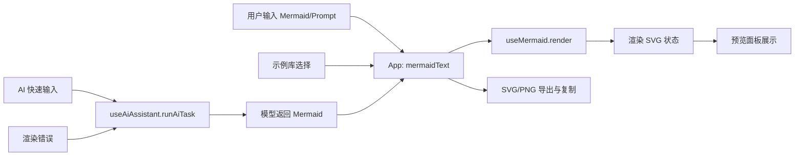
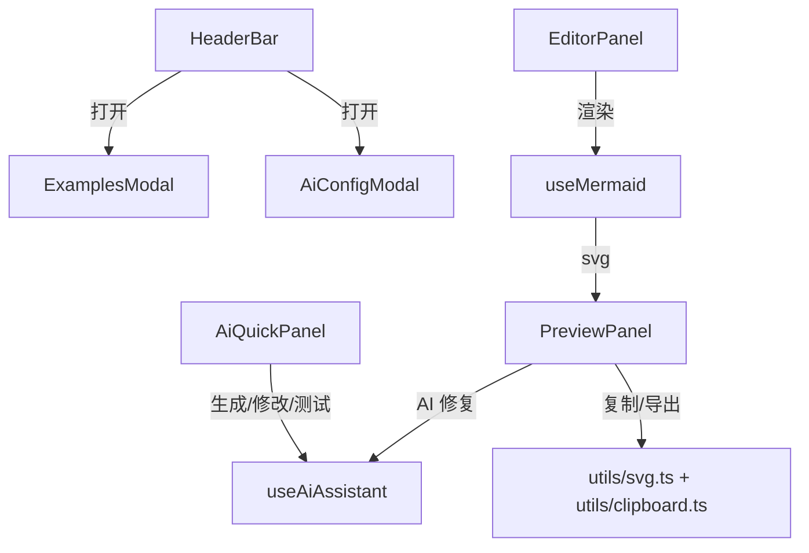
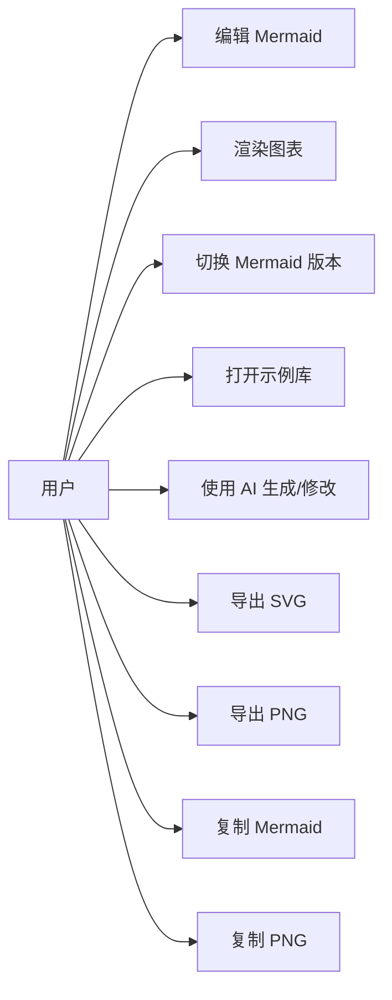

# LocalMermaid

一个基于 **React + Ant Design** 的离线 Mermaid 渲染工作台，内置示例库与 AI 助手，支持多版本切换、渲染导出与自动修复。

## 功能特性

- ⚛️ **React 组件化**：页面结构拆分为 Header Bar、AI 快速输入、编辑器、渲染面板与弹窗模块。
- 🎛️ **Ant Design 组件**：按钮、输入、选择器、开关与弹窗统一升级为 Ant Design。
- 🧩 **核心 Hook 架构**：`useMermaid` 负责渲染与版本切换，`useAiAssistant` 负责 AI 调用与状态管理。
- 📦 **离线渲染**：`public/vendor/mermaid.min.js` 与版本清单保留在本地，完全离线可用。
- 🧠 **AI 助手**：支持快速生成/修改、自动修复与配置模板管理。
- 📤 **导出能力**：支持 SVG/PNG 导出与复制。
- 📚 **示例库**：内置 16+ 类型示例并可一键载入。

## 使用指南

1. **安装依赖（必需）**

   ```bash
   npm install
   ```

   > React + Vite 版本必须先安装依赖，无法再直接打开静态 HTML 文件。当前仓库已移除 `package-lock.json`，依赖来源由 npm 自动解析。

2. **启动开发服务**

   ```bash
   npm run dev
   ```

3. **构建与预览**

   ```bash
   npm run build
   npm run preview
   ```

4. **Mermaid 版本管理**

   - 默认读取 `public/vendor/mermaid-meta.json`。
   - 若需升级 Mermaid 版本，可运行 `npm run fetch:mermaid` 并更新版本清单。

## 常见问题排查

### Windows 上安装后运行 `npm run dev` 报错 `@rollup/rollup-win32-x64-msvc`

该错误通常出现在 npm 处理 optionalDependencies 时发生。请按以下步骤恢复：

1. 删除 `node_modules` 目录。
2. 重新执行：

   ```bash
   npm install
   ```

若仍失败，可再执行一次 `npm install`。这是 npm 在 optionalDependencies 处理上的已知问题。

## 项目结构

```
LocalMermaid/
├── index.html                  # Vite 入口
├── package.json
├── public/
│   └── vendor/                 # 离线 Mermaid 资源
│       ├── mermaid.min.js
│       └── mermaid-meta.json
├── src/
│   ├── App.tsx                 # 应用入口
│   ├── main.tsx                # React 挂载
│   ├── components/             # 组件拆分
│   │   ├── HeaderBar.tsx
│   │   ├── AiQuickPanel.tsx
│   │   ├── EditorPanel.tsx
│   │   ├── PreviewPanel.tsx
│   │   ├── ExamplesModal.tsx
│   │   └── AiConfigModal.tsx
│   ├── hooks/
│   │   ├── useMermaid.ts        # Mermaid 渲染/版本切换
│   │   └── useAiAssistant.ts    # AI 调用/状态卡片
│   ├── data/
│   │   └── examples.ts         # 示例库数据
│   ├── styles/
│   │   ├── global.css           # Ant Design 主题变量
│   │   └── App.module.css       # 自定义布局样式
│   └── utils/                   # 导出/复制工具
└── scripts/
    └── download-mermaid.cjs
```

## 系统架构图（React + Ant Design）

```mermaid
graph TD
  User[用户] --> Browser[浏览器]
  Browser --> Index[index.html]
  Index --> Main[src/main.tsx]
  Main --> App[App.tsx]
  App --> HeaderBar[HeaderBar]
  App --> AiQuickPanel[AI 快速输入面板]
  App --> EditorPanel[Mermaid 编辑器面板]
  EditorPanel --> LineCount[行数统计]
  App --> PreviewPanel[渲染结果面板]
  App --> ExamplesModal[示例库弹窗]
  App --> AiConfigModal[AI 配置弹窗]
  App --> useMermaid[useMermaid Hook]
  App --> useAiAssistant[useAiAssistant Hook]
  useMermaid --> Registry[public/vendor/mermaid-meta.json]
  useMermaid --> Script[public/vendor/mermaid.min.js]
  useMermaid --> MermaidEngine[Mermaid 渲染引擎]
  useAiAssistant --> LocalStorage[浏览器本地存储]
  useAiAssistant --> Proxy[/proxy 中间件]
  Proxy --> LLM[模型 API]
  App --> Antd[Ant Design ConfigProvider]
  App --> Styles[CSS Modules + CSS Variables]
```

## 数据流图



## 调用图



## 用户视角用例图


