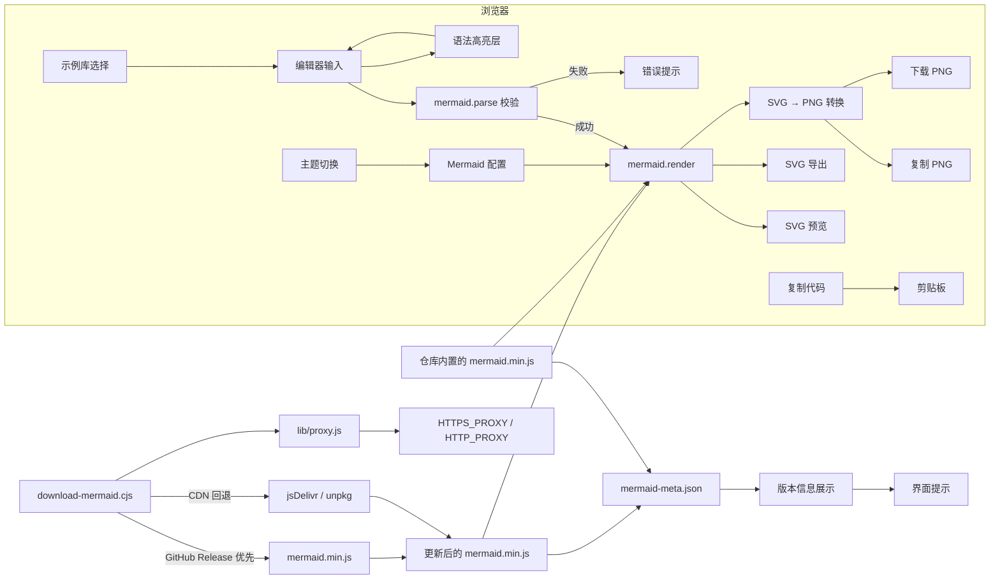
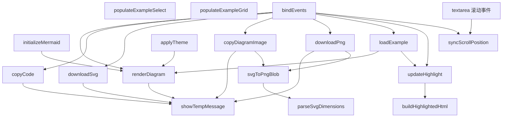

# LocalMermaid

一个可以在完全离线环境下使用的 Mermaid 渲染工作台，内置常用图表示例，支持本地编辑、实时渲染、错误提示与 SVG 导出。

## 功能特性

- 🚀 **开箱即用**：仓库自带 `public/vendor/mermaid.min.js`（当前为 v11.12.1），即使没有联网也能立即渲染。
- 🧩 **示例丰富**：内置流程图、时序图、类图、状态机、ER 图、旅程图、甘特图、思维导图等常用模板。
- 🛠️ **编辑体验**：支持语法高亮、快捷渲染（Ctrl/⌘ + Enter）、复制代码、复制 PNG、导出 SVG/PNG、主题切换、宽屏双栏预览。
- 🔍 **语法校验**：渲染前自动调用 `mermaid.parse`，第一时间暴露语法错误。

## 使用指南

1. **立即可用的离线包**

   > 仓库已经内置 Mermaid v11.12.1 的构建文件与静态资源，无需执行任何安装命令即可直接打开 `public/index.html` 使用。

   ```bash
   npm install
   ```

   > 可选：如需验证 Node.js 与 NPM 是否可用，可运行 `npm install`。项目不再依赖任何第三方包，该命令会瞬间完成且不会访问外网。

   - **需要升级 Mermaid 版本时**：运行 `npm run fetch:mermaid`。脚本会先尝试从 GitHub Release（`https://github.com/mermaid-js/mermaid/releases/download/vX.Y.Z/mermaid.min.js`）下载，若该版本未提供构建产物，则自动回退到 jsDelivr / unpkg CDN，并在 `public/vendor/mermaid-meta.json` 中记录来源与时间。
   - **完全手动下载**：优先从 GitHub Release 页面下载 `mermaid.min.js` 并覆盖到 `public/vendor/`，同时更新 `mermaid-meta.json` 中的 `version` 与 `downloadUrl`。若 GitHub 未提供构建产物，可使用 CDN 备选方案：

     ```bash
     # GitHub Release（若该版本提供）
     curl -L "https://github.com/mermaid-js/mermaid/releases/download/v11.12.1/mermaid.min.js" -o public/vendor/mermaid.min.js

     # CDN 备选
     curl -L "https://cdn.jsdelivr.net/npm/mermaid@11.12.1/dist/mermaid.min.js" -o public/vendor/mermaid.min.js
     ```

   > 下载脚本会自动读取 `HTTPS_PROXY` / `HTTP_PROXY` 环境变量（目前支持 `http://` 代理）。如需在需要代理的网络中执行，可在运行命令前设置环境变量（例如 `export HTTPS_PROXY="http://127.0.0.1:7890"`）。

2. **启动本地预览服务器（可选）**

   ```bash
   npm run start
   ```

   访问终端输出的地址（默认 `http://localhost:4173` 即可加载主页），或直接使用文件协议打开 `public/index.html`。

3. **开始绘制**

   - 在左侧编辑器输入 Mermaid 代码，点击“渲染”或使用 `Ctrl/⌘ + Enter` 快捷键。
   - 如有语法问题，错误信息会显示在预览区域顶部。
   - 支持语法高亮、一键复制代码、复制 PNG、导出 SVG/PNG，以及浅色/深色主题切换。

## 项目结构

```
LocalMermaid/
├── package.json                # NPM 脚本与项目元数据
├── public/
│   ├── assets/
│   │   ├── app.js             # 前端逻辑与渲染控制
│   │   └── styles.css         # 页面样式
│   ├── index.html             # 页面入口
│   └── vendor/                # 存放离线的 mermaid 发行文件
│       ├── mermaid.min.js     # 仓库默认内置的 Mermaid v11.12.1
│       └── mermaid-meta.json  # 记录来源、版本、更新时间
├── scripts/
│   ├── download-mermaid.cjs   # 下载最新 mermaid 的辅助脚本
│   ├── lib/
│   │   └── proxy.js           # 轻量代理解析与 CONNECT 实现
│   └── serve.cjs              # 简易静态服务器（可选）
└── README.md
```

## 系统架构图

```mermaid
graph TD
  A[用户浏览器] -->|打开| B[index.html]
  B --> C[assets/app.js]
  C --> D[Mermaid 渲染引擎<br/>public/vendor/mermaid.min.js (内置)]
  C --> HL[编辑器语法高亮层<br/>highlightLayer]
  C --> PX[PNG 导出助手<br/>svgToPngBlob]
  C --> E[assets/examples.js]
  C --> F[assets/styles.css]
  HL --> Textarea[mermaidInput 输入]
  PX --> Clipboard[Clipboard API]
  PX --> Download[本地文件保存]
  D --> I[mermaid-meta.json]
  G[scripts/download-mermaid.cjs] --> D
  G --> I
  G --> J[scripts/lib/proxy.js]
  J --> K[代理环境变量<br/>HTTP CONNECT]
  H[scripts/serve.cjs] -->|http://localhost:4173| A
```

## 数据流图



## 调用图



## 用户视角用例

```mermaid
usecaseDiagram
  actor User
  rectangle LocalMermaid {
    usecase UC1 as "选择预置示例"
    usecase UC2 as "编辑并渲染 Mermaid 图"
    usecase UC3 as "查看渲染错误提示"
    usecase UC4 as "复制当前代码"
    usecase UC5 as "导出 SVG 文件"
    usecase UC6 as "切换浅色/深色主题"
    usecase UC7 as "复制渲染 PNG"
    usecase UC8 as "下载 PNG 图像"
  }
  User --> UC1
  User --> UC2
  User --> UC3
  User --> UC4
  User --> UC5
  User --> UC6
  User --> UC7
  User --> UC8
```

## 许可证

MIT
